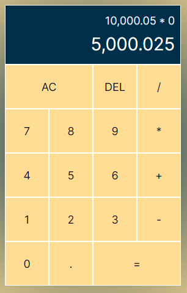

# React Calculator

This Calculator was developed using React + JavaScript, its a simple calculator that uses a lot of programming concepts, with some complexities, like operation handling and state managing that was done by using "useReducer" hook.
